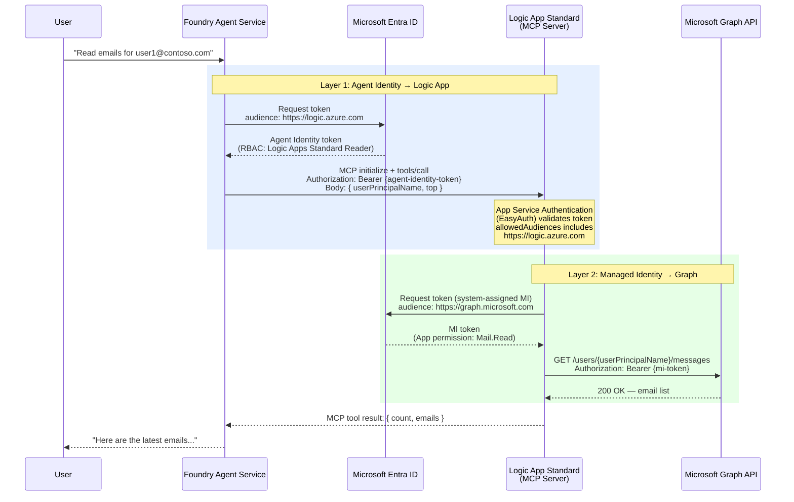

# Logic App MCP Server + Foundry Agent: Authentication Guide

## Problem: `consent.azure-apim.net` Redirect Error

When connecting a Logic App Standard MCP server to a Foundry Agent via **OAuth Identity Passthrough**, Foundry returns:

```
Error[Failed Dependency] All remote server connections failed.
https://logic-apis-eastus2.consent.azure-apim.net/login?data=...
```

---

## Root Cause Analysis

### Two separate issues cause this error

**Issue 1: `"type": "oauth2"` in host.json triggers Logic App's proprietary consent flow**

Setting `"authentication": {"type": "oauth2"}` in `host.json` under `McpServerEndpoints` activates the **Logic App connector consent flow** — a proprietary mechanism that redirects to `consent.azure-apim.net`. This is designed for browser-based MCP clients (e.g., VS Code) that can open an interactive consent page. Foundry's agent service cannot follow this redirect.

**Issue 2: Foundry "OAuth Identity Passthrough" routes Logic App endpoints through the connector layer**

Even after removing `"type": "oauth2"` from host.json, selecting **"OAuth Identity Passthrough"** in Foundry for a Logic App endpoint causes Foundry to route requests through the **Logic App API connector infrastructure** (`logic-apis-eastus2`). This connector layer has its own consent flow (`consent.azure-apim.net`) that must be completed before the MCP connection can be established.

Decoded consent redirect data confirms this:
```
LoginId:        logic-apis-eastus2_<foundry-project-id>-msftgraphemail1_token
LogConnectionId: msftgraphemail1.<connection-guid>
LogConnectorId:  <foundry-project-id>-msftgraphemail1
LogEnvironmentId: ai-<foundry-project-id>
LogAccountName:  logic-apis-eastus2
```

The `logic-apis-eastus2` account and `ai-` prefixed environment ID prove the redirect originates from **Foundry's connector infrastructure**, not from the Logic App itself.

### Why "OAuth Identity Passthrough" doesn't work for Logic App MCP connection setup

The OAuth Identity Passthrough consent flow is designed for **tool invocation time**, not **connection setup time**:

1. User asks agent to use a tool → Agent calls MCP server
2. MCP server returns `oauth_consent_request` with a consent link
3. User clicks the link, consents in browser
4. Subsequent calls succeed with the user's token

But for Logic App endpoints, Foundry wraps the connection in the Logic App connector layer, which requires consent **during MCP initialization** (the `initialize` handshake). Since the handshake is machine-to-machine (no browser), the consent redirect causes "Failed Dependency".

---

## Solution: Use a Different Authentication Type in Foundry

Since "OAuth Identity Passthrough" triggers the Logic App connector consent flow during connection setup, use one of these alternatives:

### Option A: Key-based Authentication (Simplest)

1. In **Azure Portal** → Logic App → Agents → MCP Servers → select your server
2. Under **Authentication**, select **Key-based** → **Generate key**
3. Copy the generated API key
4. In **Foundry Portal** → Agent → Tools → Add MCP:
   - **Name**: `custmailmcp`
   - **Remote MCP Server endpoint**: `https://msft-graph-logicapp-yw-uno-<xxxxx>.eastus2-01.azurewebsites.net/api/mcpservers/custmailmcp/mcp`
   - **Authentication**: Key-based
   - **Credential name**: `Authorization`
   - **Credential value**: `Bearer <your-api-key>`

### Option B: Microsoft Entra — Agent Identity (Recommended for Logic Apps)

Per [Microsoft docs](https://learn.microsoft.com/azure/foundry/agents/concepts/agent-identity#tool-authentication): *"For an Azure Logic Apps MCP server, set the audience as `https://logic.azure.com`"* and *"assign the Logic Apps Standard Reader role on the Logic App resource."*

> **What is "Agent Identity"?**
>
> The **Agent Identity** is a **user-assigned managed identity** that Azure AI Foundry automatically provisions for each project specifically for **agent tool authentication**. It is **not** the project's system-assigned managed identity.
>
> | Identity | Type | Purpose |
> |---|---|---|
> | **Agent Identity** (`agentIdentityId`) | User-assigned MI | Used by agents to authenticate to external tools (MCP servers, Logic Apps, Functions) |
> | **Project Managed Identity** | System-assigned MI | Used by the Foundry project itself for accessing Azure resources (storage, AI services, etc.) |
>
> **How to find the Agent Identity:**
>
> The Foundry Portal UI does not expose `agentIdentityId` directly. Use one of these methods:
>
> **Method 1 — Microsoft Entra ID (Enterprise Applications):**
> 1. Open **[Azure Portal](https://portal.azure.com)** → **Microsoft Entra ID** → **Enterprise applications**
> 2. Set the **Application type** filter to **Managed Identities**
> 3. Search for `AgentIdentity` — the name follows the pattern: `{foundry-resource}-{project-name}-AgentIdentity`
>    (e.g. `foundry-rs-demo-agent-yw-uno-foundry-proj-demo-agent-yw-uno-AgentIdentity`)
> 4. The **Object ID** of this service principal is the `agentIdentityId`
>
> **Method 2 — Azure CLI:**
> ```bash
> # ── Change this to match your Foundry resource name prefix ──
> FOUNDRY_RESOURCE="<your-foundry-resource-name>"
>
> az ad sp list --all \
>   --filter "startswith(displayName,'${FOUNDRY_RESOURCE}')" \
>   --query "[].{name:displayName, objectId:id}" -o table
> ```
>
> Look for the entry named `{foundry-resource}-{project-name}-AgentIdentity` (without any agent-specific suffix).
> Its `objectId` is the `agentIdentityId`.
>
> **Note:** Foundry also creates **per-agent** identities (e.g. `...-Knowledge-Agent-AgentIdentity`, `...-diabetes-care-agent-1-AgentIdentity`). The **project-level** Agent Identity (the one without an agent name in the suffix) is the one used for MCP server RBAC.
>
> This identity must be granted **Logic Apps Standard Reader (Preview)** role on the Logic App resource so Foundry agents can invoke the MCP server.

**Server-side setup (already done):**
1. EasyAuth (App Service Authentication) `allowedAudiences` includes `https://logic.azure.com` ✅
2. **Logic Apps Standard Reader (Preview)** role assigned to the project-level Agent Identity on the Logic App ✅
   - Find via: **Entra ID** → **Enterprise applications** → filter **Managed Identities** → search `{foundry-resource}-{project-name}-AgentIdentity`
   - Or via CLI: `az ad sp list --all --filter "startswith(displayName,'<foundry-resource>')" ...` (see above)

**Foundry connection setup:**
1. In **Foundry Portal** → Agent → Tools → Add MCP:
   - **Name**: `custmailmcp`
   - **Remote MCP Server endpoint**: `https://msft-graph-logicapp-yw-uno-<xxxxx>.eastus2-01.azurewebsites.net/api/mcpservers/custmailmcp/mcp`
   - **Authentication**: Microsoft Entra — Agent Identity
   - **Audience**: `https://logic.azure.com`

> **Note:** You do not need to input the `agentIdentityId` when configuring the MCP tool in Foundry — Foundry automatically uses the project-level Agent Identity. The identity details above are only needed for the server-side RBAC assignment (server-side setup item 2).

---

## Logic App Server-Side Configuration (Already Applied)

These changes are already in place and are correct regardless of which Foundry auth method you choose:

### 1. `host.json` — MCP enabled, NO authentication section

```json
{
  "version": "2.0",
  "extensionBundle": {
    "id": "Microsoft.Azure.Functions.ExtensionBundle.Workflows",
    "version": "[1.*, 2.0.0)"
  },
  "extensions": {
    "workflow": {
      "McpServerEndpoints": {
        "enable": true
      }
    }
  }
}
```

> **Do NOT** add `"authentication": {"type": "oauth2"}` — this triggers the connector consent redirect.

### 2. EasyAuth (App Service Authentication)

| Setting | Value |
|---|---|
| **Identity provider** | Microsoft |
| **Client ID** | `<Entra App Client ID e.g. 1ac142da-xxxxx>` |
| **Issuer URL** | `https://login.microsoftonline.com/<your-tenant-id>/v2.0` |
| **Allowed token audiences** | `api://<Entra App Client ID e.g. 1ac142da-xxxxx>/` AND `https://logic.azure.com` (**Note:** the trailing `/` after the client ID is required) |
| **Restrict access** | **Allow unauthenticated access** |

> **CRITICAL: The `https://logic.azure.com` audience MUST be in allowed audiences.** Foundry Agent Identity sends tokens with audience `https://logic.azure.com`. If this audience is missing from EasyAuth's `allowedAudiences`, EasyAuth interferes with the request processing and causes a **415 Unsupported Media Type** error from the MCP middleware. The original `api://` audience is still needed for VS Code / OAuth browser clients.

> Per [Microsoft docs](https://learn.microsoft.com/azure/logic-apps/create-model-context-protocol-server-standard#set-up-easy-auth-for-your-mcp-server): *"Make sure that App Service authentication (Easy Auth) allows unauthenticated access or requests."*

### 3. App Registration (Microsoft Entra ID)

| Property | Value |
|---|---|
| **Application (client) ID** | `<Entra App Client ID e.g. 1ac142da-xxxxx>` |
| **Application ID URI** | `api://<Entra App Client ID e.g. 1ac142da-xxxxx>` |
| **Expose an API → Scope** | `user_impersonation` (enabled, Admins and users) |

### 4. App Setting — Protected Resource Metadata (PRM)

```
WEBSITE_AUTH_PRM_DEFAULT_WITH_SCOPES = api://<Entra App Client ID e.g. 1ac142da-xxxxx>/user_impersonation
```

Publishes `/.well-known/oauth-protected-resource` for MCP auth spec compliance:

```json
{
  "resource": "https://msft-graph-logicapp-yw-uno-<xxxxx>.eastus2-01.azurewebsites.net",
  "authorization_servers": ["https://login.microsoftonline.com/<your-tenant-id>/v2.0"],
  "scopes_supported": ["api://<Entra App Client ID e.g. 1ac142da-xxxxx>/user_impersonation"]
}
```

Reference: [Configure built-in MCP server authorization](https://learn.microsoft.com/azure/app-service/configure-authentication-mcp)

---

## Token Passthrough Warning — Why Managed Identity Is Required

Per [Microsoft documentation](https://learn.microsoft.com/azure/app-service/configure-authentication-mcp):

> *"The token used for MCP server authorization is meant to represent access to your MCP server, and not to a downstream resource. Pass-through scenarios where the server forwards its token create security vulnerabilities, so avoid these patterns. If you need to access a downstream resource, obtain a new token through the on-behalf-of flow or another mechanism for explicit delegation."*

### The header passthrough approach fails

Using `@triggerOutputs()?['headers']?['Authorization']` in the workflow to forward the MCP authorization token to Microsoft Graph **does not work**:

1. The MCP middleware (streamable HTTP transport) **strips incoming HTTP headers** before passing the request body to the workflow trigger. The expression `@triggerOutputs()?['headers']?['Authorization']` resolves to `null`.
2. Even if the header were available, the token's audience is `https://logic.azure.com` (for the MCP server), **not** `https://graph.microsoft.com`. Graph would reject it.
3. Microsoft explicitly warns against pass-through patterns as a **security vulnerability**.

This causes the workflow's `Read_Emails` HTTP action to call Graph with an empty `Authorization` header → **401 Unauthorized** → Logic App returns **NoResponse** upstream to Foundry.

### The solution: Logic App system-assigned managed identity

Instead of forwarding the caller's token, the Logic App uses its own **system-assigned managed identity** to authenticate to Graph with **application-level permissions**. This is the recommended pattern for Logic App workflows that call downstream APIs.

---

## Working Solution: Managed Identity for Downstream Graph API Calls

### Architecture

```
Foundry Agent  ──(Agent Identity token)──►  Logic App MCP Server  ──(Managed Identity token)──►  Microsoft Graph
     │                                            │                                                    │
     │  audience: https://logic.azure.com          │  audience: https://graph.microsoft.com              │
     │  RBAC: Logic Apps Standard Reader            │  App permission: Mail.Read                         │
```

Two separate authentication layers:
- **Foundry → Logic App**: Agent Identity with audience `https://logic.azure.com` and RBAC role `Logic Apps Standard Reader (Preview)`
- **Logic App → Graph**: System-assigned managed identity with `Mail.Read` application permission

### Sequence Diagram



### Step 1: Grant Logic App Managed Identity `Mail.Read` Permission on Microsoft Graph

The Logic App's system-assigned managed identity needs the `Mail.Read` **application permission** (not delegated) on Microsoft Graph. This is granted via the Graph service principal's app role assignments.

**Why application permission (not delegated)?** The managed identity acts as a service principal — there is no signed-in user context. Application permissions allow the identity to read any user's mailbox (scoped by `userPrincipalName` in the API call).

```bash
# ── Change these variables to match your environment ──
LOGIC_APP_NAME="<your-logic-app-name>"
RESOURCE_GROUP="<your-resource-group>"
# Well-known Application ID for Microsoft Graph (same across all tenants)
GRAPH_APP_ID="00000003-0000-0000-c000-000000000000"

# Get the Logic App's managed identity principal ID
MI_OBJECT_ID=$(az webapp identity show \
  --name "$LOGIC_APP_NAME" \
  --resource-group "$RESOURCE_GROUP" \
  --query principalId -o tsv)

# Get the Microsoft Graph service principal object ID (tenant-specific)
GRAPH_SP_ID=$(az ad sp show \
  --id "$GRAPH_APP_ID" \
  --query "id" -o tsv)

# Get the Mail.Read app role ID from the Graph service principal
MAIL_READ_ROLE_ID=$(az ad sp show \
  --id "$GRAPH_APP_ID" \
  --query "appRoles[?value=='Mail.Read'].id | [0]" -o tsv)

# Assign Mail.Read to the managed identity
az rest --method POST \
  --uri "https://graph.microsoft.com/v1.0/servicePrincipals/${MI_OBJECT_ID}/appRoleAssignments" \
  --headers "Content-Type=application/json" \
  --body "{
    \"principalId\": \"${MI_OBJECT_ID}\",
    \"resourceId\": \"${GRAPH_SP_ID}\",
    \"appRoleId\": \"${MAIL_READ_ROLE_ID}\"
  }"
```

| Identity | Principal ID | Permission | Type | Target |
|---|---|---|---|---|
| Logic App MI | `<logic-app-mi-principal-id>` | `Mail.Read` | Application | Microsoft Graph SP |

### Step 2: Update the Workflow to Use Managed Identity

The workflow uses `ManagedServiceIdentity` authentication instead of header passthrough, and calls `/users/{userPrincipalName}/messages` instead of `/me/messages` (since `/me` requires a delegated user context).

See: [`manual_principle_passthrough/email_workflow_principlename_passthrough.json`](../manual_principle_passthrough/email_workflow_principlename_passthrough.json)

```json
{
    "definition": {
        "$schema": "https://schema.management.azure.com/providers/Microsoft.Logic/schemas/2016-06-01/workflowdefinition.json#",
        "contentVersion": "1.0.0.0",
        "triggers": {
            "manual": {
                "type": "Request",
                "kind": "Http",
                "inputs": {
                    "schema": {
                        "type": "object",
                        "properties": {
                            "top": {
                                "type": "integer",
                                "description": "Number of emails to retrieve (default 10)"
                            },
                            "userPrincipalName": {
                                "type": "string",
                                "description": "The user principal name (email) of the mailbox to read, e.g. admin@contoso.onmicrosoft.com"
                            }
                        },
                        "required": ["userPrincipalName"]
                    }
                }
            }
        },
        "actions": {
            "Read_Emails": {
                "type": "Http",
                "inputs": {
                    "uri": "@concat('https://graph.microsoft.com/v1.0/users/', triggerBody()?['userPrincipalName'], '/messages?$top=', coalesce(triggerBody()?['top'], 10), '&$select=subject,from,receivedDateTime,bodyPreview,isRead')",
                    "method": "GET",
                    "authentication": {
                        "type": "ManagedServiceIdentity",
                        "audience": "https://graph.microsoft.com"
                    }
                },
                "runAfter": {}
            },
            "Return_Emails": {
                "type": "Response",
                "kind": "Http",
                "inputs": {
                    "statusCode": 200,
                    "headers": { "Content-Type": "application/json" },
                    "body": {
                        "count": "@length(body('Read_Emails')?['value'])",
                        "emails": "@body('Read_Emails')?['value']"
                    }
                },
                "runAfter": { "Read_Emails": ["Succeeded"] }
            }
        },
        "outputs": {}
    },
    "kind": "Stateful"
}
```

Key changes from the original header-passthrough workflow:

| Aspect | Before (broken) | After (working) |
|---|---|---|
| **Graph auth** | `"headers": {"Authorization": "@triggerOutputs()?['headers']?['Authorization']"}` | `"authentication": {"type": "ManagedServiceIdentity", "audience": "https://graph.microsoft.com"}` |
| **Graph endpoint** | `/me/messages` | `/users/{userPrincipalName}/messages` |
| **Input params** | `top` only | `top` + `userPrincipalName` (required) |
| **Permission model** | Delegated (user token) | Application (managed identity) |

### Step 3: Deploy the Workflow

Deploy the updated `email_workflow_principlename_passthrough.json` to the Logic App via Kudu SCM API:

```bash
# ── Change these variables to match your environment ──
LOGIC_APP_NAME="<your-logic-app-name>"
RESOURCE_GROUP="<your-resource-group>"
# Logic App workflow name as registered in the MCP server
WORKFLOW_NAME="msft-graph-access"
# Local path to the workflow JSON file
WORKFLOW_FILE="../manual_principle_passthrough/email_workflow_principlename_passthrough.json"

# Get the SCM hostname for your Logic App
SCM_HOST=$(az webapp show \
  --name "$LOGIC_APP_NAME" \
  --resource-group "$RESOURCE_GROUP" \
  --query "hostNameSslStates[?hostType=='Repository'].name | [0]" -o tsv)

TOKEN=$(az account get-access-token --resource https://management.azure.com --query accessToken -o tsv)

curl -X PUT \
  "https://${SCM_HOST}/api/vfs/site/wwwroot/${WORKFLOW_NAME}/workflow.json" \
  -H "Authorization: Bearer $TOKEN" \
  -H "If-Match: *" \
  -H "Content-Type: application/json" \
  --data-binary @"${WORKFLOW_FILE}"

# Restart to pick up changes
az webapp restart --name "$LOGIC_APP_NAME" --resource-group "$RESOURCE_GROUP"
```

---

## Complete RBAC Summary

| Identity | Role / Permission | Scope | Purpose |
|---|---|---|---|
| Foundry Project-level Agent Identity | **Logic Apps Standard Reader (Preview)** | Logic App resource | Allows Foundry agent to invoke the MCP server |
| Logic App system-assigned MI | **Mail.Read** (application) | Microsoft Graph | Allows Logic App to read user mailboxes via Graph API (granted from az cli) |

---

## Summary: Verified Working End-to-End Solution

1. **Foundry → Logic App MCP**: Use **Microsoft Entra — Agent Identity** authentication with audience `https://logic.azure.com`
2. **Agent Identity RBAC**: Assign **Logic Apps Standard Reader (Preview)** role to the Foundry agent identity on the Logic App resource
3. **EasyAuth**: Include `https://logic.azure.com` in `allowedAudiences` (alongside the `api://` audience)
4. **Logic App → Graph**: Use **system-assigned managed identity** with `Mail.Read` application permission
5. **Workflow**: Call `/users/{userPrincipalName}/messages` with `ManagedServiceIdentity` auth (not `/me/messages`, not header passthrough)
6. **Do NOT use** OAuth Identity Passthrough — it triggers the Logic App connector consent flow which fails in machine-to-machine contexts

---

## Key References

- [Create MCP servers from Standard workflows](https://learn.microsoft.com/azure/logic-apps/create-model-context-protocol-server-standard)
- [Configure built-in MCP server authorization](https://learn.microsoft.com/azure/app-service/configure-authentication-mcp)
- [Set up MCP authentication for Foundry agents](https://learn.microsoft.com/azure/foundry/agents/how-to/mcp-authentication)
- [Connect MCP server on Azure Functions to Foundry](https://learn.microsoft.com/azure/azure-functions/functions-mcp-foundry-tools)
- [MCP authorization specification](https://modelcontextprotocol.io/specification/2025-06-18/basic/authorization)