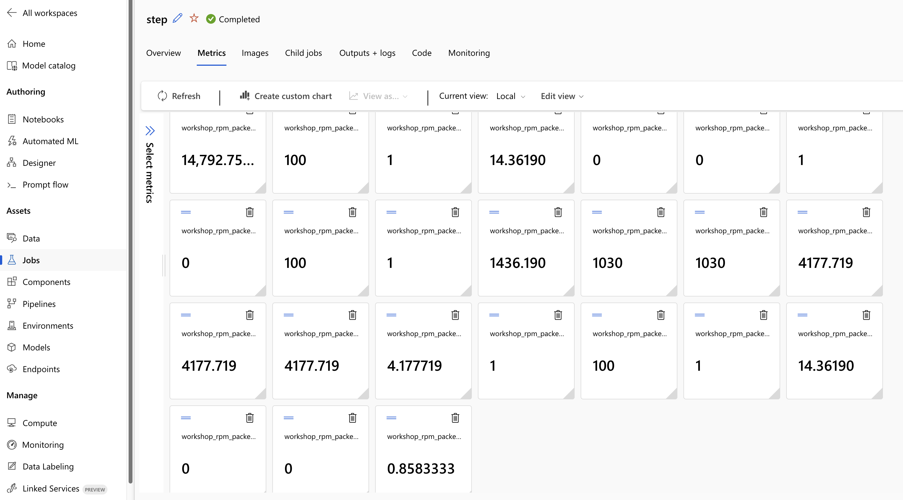

# 03 — RPM and Packing Experiment

**Time:** 15 minutes  
**Goal:** Prove that input-array packing reduces client HTTP requests for the same successful logical work.

> Disclaimer: This is a learning/sample artifact — not production hardened.

---

## Hypothesis and Controls

For $N$ logical inputs and an average of $B$ inputs/request:

$$
\mathrm{HTTP\ requests}=\left\lceil\frac{N}{B}\right\rceil
$$

$$
\mathrm{request\ reduction}=1-\frac{\mathrm{HTTP\ requests}}{N}
$$

Keep the corpus, direct deployment, retry policy, and output validation identical. Change only packing and concurrency.

!!! important "What this experiment proves"
    It proves client HTTP request reduction. It does not assume Azure's internal ADA Embedding Model call-rate accounting decreases by exactly the same factor.

## A — One Input per Request

```bash
uv run aml-batch-embeddings invoke \
  --model ada \
  --experiment-kind rpm \
  --input data/workshop-rpm \
  --packing none \
  --max-retries 0 \
  --request-concurrency 20 \
  --metric-logging mlflow \
  --metric-prefix workshop_rpm_none
```

## B — Packed Input Array

```bash
uv run aml-batch-embeddings invoke \
  --model ada \
  --experiment-kind rpm \
  --input data/workshop-rpm \
  --packing batch \
  --max-inputs-per-request 100 \
  --max-tokens-per-request 1200 \
  --max-retries 0 \
  --request-concurrency 1 \
  --metric-logging mlflow \
  --metric-prefix workshop_rpm_packed
```

Both commands omit pacing. The small fixture is designed to compare request shape, not locate a sustained boundary.

## Export Both Reports

```bash
uv run aml-batch-embeddings metrics <none-parent-job-id> \
  --prefix workshop_rpm_none \
  --output outputs/workshop/rpm-none-metrics.json

uv run aml-batch-embeddings metrics <packed-parent-job-id> \
  --prefix workshop_rpm_packed \
  --output outputs/workshop/rpm-packed-metrics.json
```

## Verified Result

The fresh packed run is grouped separately from TPM experiments:

| AML field | Value |
|---|---|
| Experiment | `embeddings-rpm-ada-packed-input-array` |
| Parent job | `pipelinejob-b54e598a-5d65-4721-8493-aa1d4af565a0` |
| Child task | `fb4367cb-bc85-4123-8927-82df86fe55e8` |
| Metrics tab prefix | `workshop_rpm_packed_v2.*` |

Open the **child task**, then select the **Metrics** tab. Parent pipeline jobs
show orchestration; the child command job owns the embedding metrics.

{ .zoomable-media }

*AML Studio child task metrics for `workshop_rpm_packed_v2.*`. The corresponding
JSON export is the reproducible source for exact metric names and values.*

| Metric | One input/request | Packed array |
|---|---:|---:|
| Logical inputs | 100 | 100 |
| Prompt tokens | 1,030 | 1,030 |
| HTTP requests | 100 | 1 |
| Inputs/request | 1 | 100 |
| Request-window RPM | 2,500.645 | 14.362 |
| Failed requests | 0 | 0 |
| Unique output IDs | 100 | 100 |
| Token estimate/actual | Not calculated without token ceiling | 1.000 |

The packed value is a short-window burst metric over 4.178 seconds. It is shown
to explain the run, not as a sustained-capacity claim.

Request reduction:

$$
1-\frac{1}{100}=99\%
$$

The packed request had higher per-request latency because it carried all 100 inputs. The optimization target is request consumption, not minimum latency for an individual HTTP call.

## Why Zero 429 Does Not Disprove RPM Pressure

The 100-request control started all requests in about two seconds and Azure accepted them. Azure documents short-window evaluation but can allow service-controlled bursts. A larger prior experiment sent 1,200 one-input requests: 870 succeeded and 330 returned explicit call-rate HTTP 429 responses.

A later packed small-chunk run attempted 1,200 logical inputs in 13 arrays. Nine arrays succeeded and four returned explicit call-rate 429 while accepted tokens remained below 15,000. This means packing's client request reduction is proven, but the ADA Embedding Model's internal call-rate accounting for packed inputs remains empirical.

## Pass Criteria

- same input ID set and prompt-token total;
- zero missing or duplicate outputs;
- materially fewer HTTP requests;
- no claim that a short burst establishes assigned RPM;
- service error wording retained when a larger load is throttled.

---

Next: [04 — TPM and APIM Pooling Experiment](04-tpm-apim-pooling-experiment.md)
