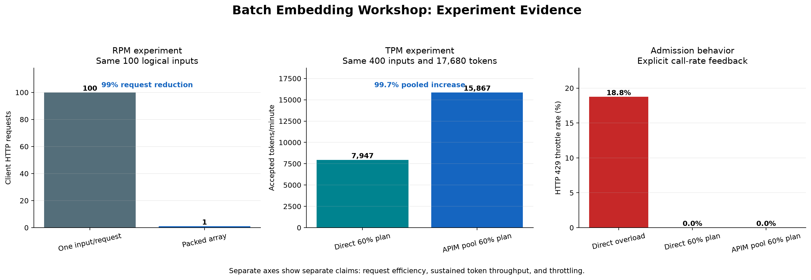

# 05 — Evidence, Errors, and Operations

**Time:** 10 minutes  
**Goal:** Export AML metrics, classify rate-limit evidence conservatively, and separate proven claims from production follow-up.

> Disclaimer: This is a learning/sample artifact — not production hardened.

---

## Find Metrics in AML Studio

MLflow metrics belong to the child command job:

1. Open **Azure Machine Learning studio → Jobs**.
2. Open the parent `pipelinejob-...` run.
3. Select the embedding step.
4. Open **Metrics**.
5. Select the experiment prefix, such as `workshop_rpm_packed_v2.*`.

Azure ML automatically starts the MLflow run for job code. The component logs directly with `mlflow.log_metrics()`.

Reference: [View MLflow metrics in Azure Machine Learning studio](https://learn.microsoft.com/azure/machine-learning/how-to-log-view-metrics?view=azureml-api-2#view-information-about-jobs-or-runs-in-the-studio).

## Export Metrics as JSON

Portal screenshots support instruction, but JSON is the reproducible evidence:

```bash
uv run aml-batch-embeddings metrics <parent-or-child-job-id> \
  --prefix workshop_rpm_packed_v2 \
  --output outputs/workshop/rpm-packed-v2-metrics.json
```

The report contains:

- requested parent and resolved child IDs;
- child status;
- selected metric prefix;
- attempted/successful RPM;
- accepted TPM and prompt-token totals;
- request/input totals and success rate;
- 429 count/rate;
- latency percentiles;
- item/token fill ratios;
- configured experiment pacing targets.

`trace.jsonl` remains the request-level record. It stores statuses, retry guidance, request timing, and token counts without source text, vectors, credentials, or bearer tokens.

## Analytics of Experiments

The analysis chart is generated from exported AML child-run metric JSON files.
It separates three questions because requests, tokens/minute, and throttle rate
must not share one axis.

{ .zoomable-media }

### How to interpret the chart

| Panel | Observation | Supported conclusion | Do not conclude |
|---|---|---|---|
| RPM experiment | 100 client requests became 1 for the same 100 inputs and 1,030 tokens | Packing reduced client HTTP request consumption by 99% | Azure's internal call-rate accounting necessarily fell by 99% |
| TPM experiment | APIM accepted 15,867.064 TPM versus 7,946.988 direct for the same 400 inputs and 17,680 tokens | The independently allocated pool delivered 99.661% more accepted TPM at the tested safe rates | APIM created quota or this is the maximum safe production target |
| Admission behavior | Historical direct overload had 18.75% HTTP 429; both 60% plan runs had 0% | Offered load and experiment sequencing determine whether a run is valid capacity evidence | Every 429 is TPM-related or retries should hide the boundary |

### How the system behaved differently

**One input per request:** the client created 100 requests in a 2.399-second
window. Azure accepted this short burst, but larger prior runs produced explicit
call-rate 429 responses. Short success does not establish assigned RPM.

**Packed input array:** the same 100 logical inputs and 1,030 prompt tokens used
one client request. Output correlation remained complete. Per-request latency
increased because one request carried all inputs, but request amplification was
removed.

**Overloaded direct route:** token-aware arrays and a 12K TPM target still
produced three explicit call-rate 429 responses. Only 323 of 400 logical inputs
succeeded. Token pacing alone was therefore insufficient for that workload
regime.

**60% direct plan:** offering 9K target TPM and 180 logical
inputs/minute produced 400/400 successes, 7,946.988 accepted TPM, and zero
throttling over 133.485 seconds.

**60% APIM pool plan:** doubling offered load to 18K target TPM and 360 logical
inputs/minute produced the same successful work in 66.855 seconds, 15,867.064
accepted TPM, and zero throttling. This is the cleanest AML evidence that the
pool exposes more usable capacity than one direct deployment.

Latency metrics use percentiles: p50 is the median, p95 covers 95% of requests,
and p99 covers 99%. Lower is better. With only 16 requests in each TPM run,
p95/p99 should be treated as directional tail-latency signals rather than stable
production estimates.

The slower pooled p95/p99 cannot be attributed to the APIM circuit breaker from
this run. No request returned HTTP 429 or 503, so there is no signal that a
breaker opened. A circuit breaker normally removes an unhealthy backend from
selection; it does not intentionally delay successful requests. Plausible tail
contributors include APIM processing, regional network distance, backend
variance, and queueing. Proving breaker involvement requires APIM diagnostics
that correlate selected backend and breaker state with each slow request.

### Regenerate the chart

Install authoring dependencies and export the named AML reports first:

```bash
python -m pip install -r requirements_dev.txt
python analyze_workshop_experiments.py
```

The generator is `analyze_workshop_experiments.py`. By default it reads the
sanitized committed fixtures in `data/experiment-metrics/`, so the chart can be
reproduced without Azure access. Pass `--input-dir outputs/workshop` to use fresh
live exports instead. The PNG is a documentation artifact; live exported JSON
reports remain the source of exact job identifiers.

## Distinguish RPM from TPM Evidence

Both limiters can return HTTP 429. Classify evidence in this order:

| Evidence | Classification | Confidence |
|---|---|---|
| Error explicitly says `call rate` or `request rate` | `rpm-explicit` | Proof for that response |
| Error explicitly says `token rate` | `tpm-explicit` | Proof for that response |
| Request counter is zero while token counter has headroom | `rpm-likely` | Diagnostic inference |
| Token counter is zero while request counter has headroom | `tpm-likely` | Diagnostic inference |
| Both counters exhausted, absent, or conflicting | `unknown` | Do not guess |

`Retry-After` tells the client when to retry. It does not identify the limiter. Latency, request sequence, or local token estimates alone are also insufficient.

Azure documents that RPM and TPM are paired at quota allocation but measured separately during inference: [Understand rate limits](https://learn.microsoft.com/azure/foundry/openai/how-to/quota#understanding-rate-limits).

## Circuit-Breaker Evidence

The configured APIM rule trips a backend after repeated 429 responses in its observation interval. When tripped:

- APIM stops selecting that backend temporarily;
- remaining eligible backends can continue serving;
- APIM can return 503 when no backend remains eligible;
- traffic can resume after the trip duration.

A 429 does not prove the breaker opened. A later 503 is consistent with no eligible backend, but authoritative proof requires APIM diagnostics or Azure Monitor backend telemetry.

Reference: [APIM circuit breaker](https://learn.microsoft.com/azure/api-management/backends#circuit-breaker).

## Resilience Extension

Run separately from capacity measurement:

1. Establish successful traffic and backend-member telemetry.
2. Deliberately overload one backend with retries disabled.
3. Observe enough configured 429 responses to satisfy the breaker rule.
4. Verify traffic stops reaching that backend.
5. Verify the other backend continues when eligible.
6. After the trip duration, verify the backend receives traffic again.

Do not use this failure injection during the direct-versus-pool capacity A/B.

## Evidence Status

| Claim | Status | Remaining work |
|---|---|---|
| Packing reduces client HTTP requests | Verified: 100 → 1 for identical 100 inputs | Repeat for representative distributions |
| Token estimates match service prompt tokens | Verified on packed workshop runs | Monitor after tokenizer/model changes |
| APIM managed-identity route works | Verified | None for path validation |
| Pool exceeds one direct deployment | Verified in the AML 60% plan A/B: 15,867.064 versus 7,946.988 accepted TPM | Repeat and capture backend-member telemetry |
| Exact ADA Embedding Model RPM | Unknown | Service did not return request-limit header; public ratio unavailable |
| Packed arrays reduce model-side call accounting 1:1 | Not proven | Controlled clean-window boundary experiment |
| Circuit breaker withdraws/restores one backend | Pending | Failure injection plus APIM diagnostics |

## Workshop Completion Checklist

- [x] Explain service request limits versus deployment capacity.
- [x] Run and export the RPM packing A/B.
- [x] Explain direct and pooled TPM targets.
- [x] Run and export a successful direct/APIM comparison at the 60% plan.
- [x] Locate child metrics in AML Studio.
- [x] Classify 429 evidence without guessing.
- [ ] Repeat sustained TPM and breaker experiments before production adoption.

---

Return to [01 — Problem and Solution Architecture](index.md).
